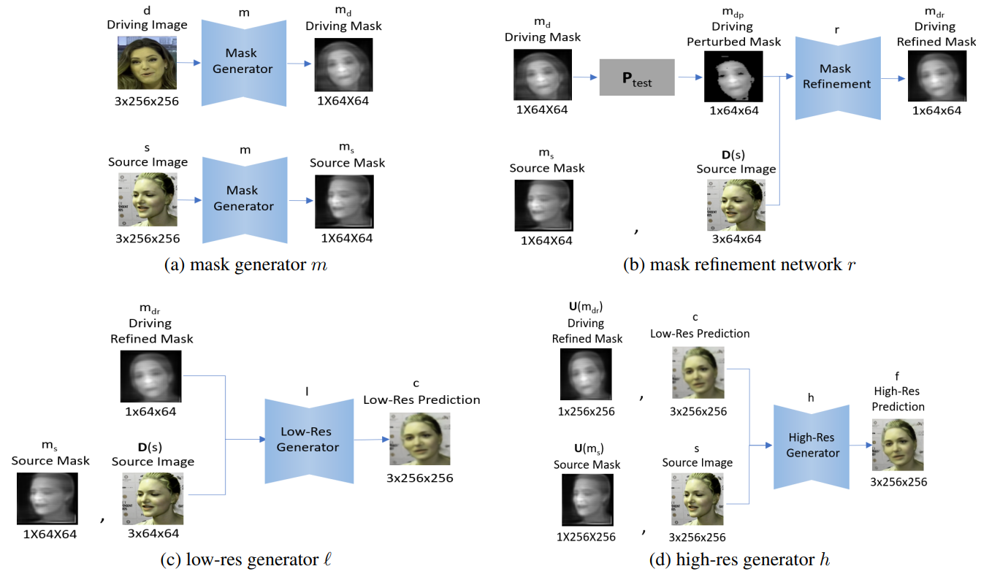

# PyTorch Implementation of [Image Animation with Perturbed Masks](https://arxiv.org/abs/2011.06922) [CVPR 2022]
[[Paper]](https://arxiv.org/abs/2011.06922)

See samples and intermediate results in samples/main.html.

## <u>Method Overview</u>
<br/>



## <u>Installation</u>
Tested using python 3.6.10.

You can install this repo as a Python package:
```bash
$ conda install pytorch==1.0.0 torchvision==0.2.1 cuda100 -c pytorch
$ pip install git+https://github.com/itsyoavshalev/Image-Animation-with-Perturbed-Masks.git
```

## <u>Datasets</u>
In order to download the datasets, follow the instructions on https://github.com/AliaksandrSiarohin/first-order-model.

## <u>Training</u>
To train using a specific dataset, run the following command:
```bash
$ python run.py --config config/dataset_name.yaml
```
Checkpoints and outputs will be saved into the log folder.

## <u>Reconstruction</u>
In order to evaluate the video reconstruction using a specific dataset and a checkpoint path, run the following command:
```bash
$ python run.py --config config/dataset_name.yaml --mode reconstruction --checkpoint checkpoint_path
```
Outputs will be saved into the log folder.

## <u>Animation Demo</u>
To run the image animation pipeline for a specific dataset and a checkpoint path, run the following command:
```bash
$ python run.py --config config/dataset_name.yaml --mode animate --checkpoint checkpoint_path
```
Outputs will be saved into the log folder.